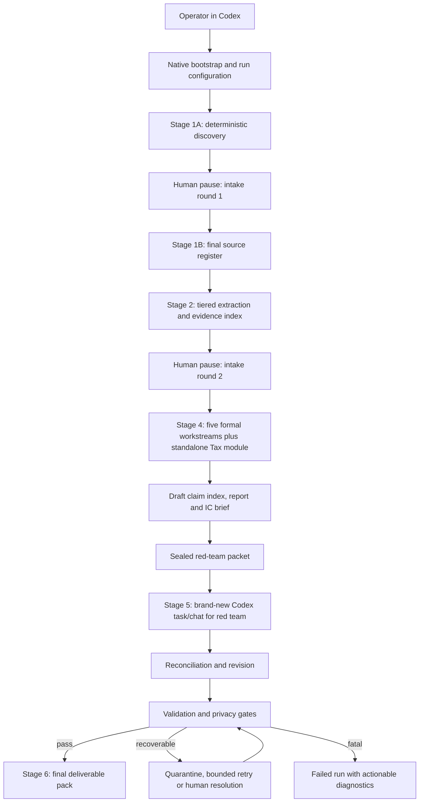

# Due-diligence engine architecture

## Status and scope

This document defines an implementation architecture; it does not implement the engine. The chosen runtime harness is **Codex**. Deterministic supporting code will target **Python 3.11 or later**. The native path must work without Docker; a container may later be offered only as an optional convenience.

The design optimizes for an auditable cold run over an unseen, confidential room. It separates repeatable mechanics from model judgment, makes human pauses resumable, isolates red-team context, and never turns a partial or privacy-unsafe run into an apparent success.

## Assumptions and non-assumptions

Assumptions justified by the brief or current directive:

1. The operator has Git because the evaluation starts from a clone, Codex because it is the selected harness, and Python 3.11+ because it is the selected supporting runtime.
2. Codex is already usable under the operator's subscription. The engine will not ask for a provider API key or make direct model API calls from Python.
3. A run has local read access to one data-room folder and local write access to a separate output folder.
4. The deal lead can edit or supply Markdown/JSON answer files at two explicit pauses.
5. The numbered stages are contract labels implemented as a dependency graph: round one occurs after quick deterministic discovery, and round two occurs after the complete source register and a preliminary full extraction pass.

This design does **not** assume an operating system, Docker, a GPU, Microsoft Office, LibreOffice, Tesseract, a database, cloud storage, a queue, telemetry, third-party logging, direct API credentials, or a particular package manager. Optional detected tools may accelerate work but cannot be on the required path. Whether dependency installation must work without internet access is not stated and remains open.

## Execution planes

| Plane | Responsibility | May reason? | May mutate source room? | Principal artifacts |
|---|---|---:|---:|---|
| Deterministic local processing | Inventory, hashing, safe archive inspection, native extraction, evidence addresses, calculations, ledgers, rendering, validation | No | No | Register, extraction records, evidence index, calculations, manifests |
| Codex reasoning | Dynamic questions, classification escalation, workstream analysis, synthesis and drafting | Yes | No | Questions, findings, report draft, route events |
| Human/deal-lead pauses | Answer evidence-driven questions, optionally enable narrowly scoped public research, resolve material ambiguity | Human judgment | No | Answers and signed pause/resume records |
| Independent red-team execution | Refute issues, independently recompute headline numbers, find gaps | Yes, only in a brand-new Codex task/chat | No | Allowlisted sealed-packet manifest, challenge log, recalculations, isolation manifest |
| Validation and failure handling | Enforce stage contracts, citation resolution, privacy, completeness and honest failure states | Deterministic rules plus explicit human review gates | No | Validation report, quarantine ledger, terminal run status |

## System context and flow



Stage 3 comprises both human pauses and their question-generation/resume contracts. Round one follows quick deterministic discovery. Round two follows the complete source register and preliminary full extraction. Stage 4 starts only after round two is answered or the deal lead explicitly records that an answer is unavailable. Stage 6 packages only validated artifacts.

## Planned repository boundaries

Names below are contracts for implementation, not files that exist yet.

```text
AGENTS.md                         Codex entry contract and privacy rules
README.md                         clean-clone setup and one-path runbook
pyproject.toml                    Python 3.11+ package and locked tool config
src/dd_engine/
  bootstrap/                     configuration and capability discovery
  inventory/                     file walk, hashes, duplicates, versions, archives
  extraction/                    native parsers, confidence and escalation packets
  evidence/                      immutable document IDs and native locators
  citations/                     format-specific citation encoding and resolution
  calculations/                  financial/tax tie-outs and reproducible tables
  tax/                           standalone structured tax analysis and cross-links
  state/                         resumable run state and stage manifests
  logging/                       local run, route, cost and research ledgers
  validation/                    stage, citation, privacy and deliverable gates
  rendering/                     in-process pure-Python A4 PDF generation and page check
prompts/
  intake/                        evidence-driven round contracts
  workstreams/                   five scoped analyst contracts
  tax/                           standalone tax-analysis contract
  red-team/                      new-task/chat refutation contract and packet allowlist
config/
  model-routing.yml              logical route policy, not provider credentials
  privacy.yml                    deny-by-default egress policy
schemas/                         artifact JSON Schemas
tests/                            unit, fixture, failure and clean-clone tests
synthetic-room/                  exactly 90 visible files; one ZIP contains 10 members
runs/<run-id>/                   local, append-only run artifacts
```

The source room is always read-only. All derived content is written beneath the selected run directory, which must be outside the source room to prevent recursive ingestion.

## Deterministic local processing

### Bootstrap and configuration

The native bootstrap verifies Python `>=3.11`, creates or uses an isolated local environment, validates config, checks that source and output paths are distinct, and reports optional capabilities. It must not require Docker. The setup guide will present one primary path and a timed smoke test rather than a menu of partially supported options.

No exact dependency manager or system utility is mandated at architecture time because the source brief does not provide those environmental guarantees. The implementation must choose and lock Python dependencies that install and smoke-test within the 20-minute clean-clone gate.

### Source register

The registrar walks all files without executing content or macros. Each entry receives a stable `document_id`, relative path, size, media type, SHA-256 hash, container/member path, timestamps where available, parser status, duplicate group, version/supersession candidates, classification, sensitivity flags and error codes. The synthetic-room register must contain exactly 100 logical artifacts: 90 visible files, including one ZIP container, plus exactly 10 registered members inside that ZIP.

Archives are treated as containers. Expansion must reject path traversal and unsafe members, cap nested work deterministically, and record skipped content rather than silently omitting it. Exact size/depth limits require implementation benchmarks and are an open decision.

Byte-identical files are deterministic duplicates. Supersession is a candidate relationship based on filename/version metadata and changed content; it is never silently resolved. The register records both the proposed winner and the evidence for that proposal.

### Tiered extraction

The extraction ladder is cheapest and most deterministic first:

1. Native local parse for text-bearing PDF, DOCX, XLSX/CSV and metadata-bearing images.
2. Structural recovery and alternate local parsing for damaged or unusual files.
3. Economy Codex route for classification or bulk interpretation that cannot be completed deterministically.
4. Frontier Codex route only where visual interpretation or material judgment is necessary.
5. Quarantine with an explicit gap if extraction remains unreliable.

The local layer records raw values, displayed values, formulas when present, hidden-sheet state, page/sheet coordinates and parse warnings. It never executes workbook macros. Cached formula values are evidence, not proof of recalculation; material figures are recomputed by explicit Python calculations from cited inputs where possible.

### Evidence addresses and citations

An immutable evidence record contains:

```text
document_id + content_hash + native_locator + extracted_span_hash + extraction_method
```

Citation locators are locked by format:

- PDF: source ID, source hash and one-based page number.
- Spreadsheet: source ID, source hash, sheet name and cell or cell range.
- DOCX: source ID, source hash and paragraph number or table/row locator; a rendered page may be added only when that page was produced deterministically.
- Image: source ID, source hash, image/page index and rectangular region coordinates in the intrinsic source coordinate space.

Archive members also retain their container/member path, but that path does not replace the required format locator. The citation index stores these fields structurally rather than embedding an unparseable prose reference.

Every material claim receives a stable `claim_id`, at least one resolvable evidence address, evidence strength, confidence, inference/direct-observation label, workstream owner and decision impact. Validators reject dangling addresses and flag unsupported or overconfident claims. Source text is quoted only minimally; the report points back to the source location.

### Calculations

Python calculation modules create transparent input tables and formula outputs for EBITDA bridges, customer concentration, debt/net-debt, working capital, payroll/headcount, tax tie-outs and other headline figures. Each result records source cells, formula/version and output hash. Codex interprets the result; it does not replace the arithmetic ledger.

## Codex reasoning

Codex is the orchestrator and the sole model-access path. It reads the checked-in workflow contract, invokes local Python stages, writes structured reasoning artifacts, stops at human gates, and records route events. Python does not import a provider SDK, read an API key, or initiate a model request.

### Routing policy

Routing uses logical profiles so it remains explicit while tolerating the evaluator's subscribed model availability:

| Profile | Intended use | Default selection rule | Escalation rule |
|---|---|---|---|
| `deterministic` | Inventory, hashes, native extraction, calculations, validation | Python only | Escalate only on recorded parse/confidence failure |
| `economy_mechanical` | Classification, bulk normalization, low-risk visual transcription | Fastest suitable lower-cost Codex model available | Escalate for materiality, ambiguity or failed verification |
| `frontier_judgment` | Financial reasoning, all workstream conclusions, drafting and final synthesis | Strongest suitable reasoning Codex model available | No downgrade without logged operator decision |
| `frontier_red_team` | Independent refutation and recomputation review | Strong frontier model in a fresh context | Fail isolation rather than reuse drafting context |

Implementation must resolve these profiles to concrete model IDs in checked-in config for the supported Codex environment, while allowing an availability override. The actual resolved model, task purpose, input artifact hashes and outcome are logged. Exact default IDs cannot be chosen safely until the evaluator's Codex model entitlements are known.

### Workstream contracts

The five formal workstreams are:

1. Financial
2. Commercial
3. Legal/contractual, explicitly scoped to Irish jurisdiction
4. Operational/management
5. IT

Each consumes the shared evidence index and relevant deal-lead answers, but writes separate claim, gap, question and priority records. Cross-workstream claims are linked, not copied. Each section must state findings, evidence, contradictions, calculations, limitations, management questions and go/no-go or price/structure implications.

### Tax handling

Tax is a **mandatory standalone analytical module**, not a sixth formal workstream and not owned by Financial. It consumes the shared evidence index and deal-lead answers, writes structured `tax/tax-findings.json` plus narrative `tax/tax-analysis.md`, and supplies its own top-level Tax section in `report.md`. VAT, PAYE, CT, amended returns, tax clearance, tax computations, invoice samples and tax-response versions receive explicit coverage and tie-outs.

Each tax finding has its own ID, evidence links, calculation links, confidence, impact and follow-up. Where relevant, the module creates bidirectional finding links into Financial, Legal/contractual, Operational/management and IT; absence of a relevant cross-link is a validation error. The five formally named workstreams remain unchanged.

### Intake questions and human pauses

Round one follows quick deterministic discovery of paths, hashes, media types and high-level document classes. It asks only questions triggered by those observed facts and deal configuration. Round two follows the complete source register and a preliminary full extraction pass across every registerable logical artifact; it focuses on missing documents, extraction failures, contradictions, price/structure assumptions and material unresolved items.

At each pause Codex writes a question packet with question ID, trigger evidence, materiality, requested answer and affected workstreams. The run state becomes `AWAITING_DEAL_LEAD`. Resumption hashes the answer file and records who/when if supplied. An explicit “unknown/not available” is a valid answer; silent absence is not.

### Report drafting

Codex drafts from structured claims and calculations, not directly from an unbounded room dump. The report is Markdown and includes an executive view, scope/limitations, five formal workstreams, a standalone Tax section, decision implications, source index and red-team appendix. The IC brief is authored as Markdown and rendered in-process by deterministic pure-Python code to ISO A4 PDF. A pure-Python PDF parser validates the media box and asserts exactly two pages programmatically. No Office, LibreOffice, Docker, browser or external renderer is permitted on this path.

## Independent red-team execution

The red-team packet is deny-by-default and contains only files enumerated in a sealed allowlist: the final candidate report, claim index, source register, specifically selected evidence records/source files, calculation inputs/results, outstanding-gap list and red-team instructions. Its manifest records each permitted path and hash. It excludes drafting conversation, workstream scratch notes, prompt transcripts, rejected drafts, prior agent messages, private reasoning and planted-issue ground truth.

Execution occurs in a brand-new Codex task/chat with a new task/chat ID and no inherited messages or context. An ordinary subagent is not independent unless the harness exposes verifiable non-inheritance and the isolation manifest records that proof; otherwise it is rejected. If launch cannot be automated, the run pauses and instructs the operator to open a brand-new Codex task/chat and attach only the allowlisted sealed packet. The original drafting context may never perform or simulate the independent pass.

For every material issue, red team records `upheld`, `modified`, `rejected` or `insufficient evidence`; it recomputes headline numbers from cited source inputs and adds newly found gaps. Drafting reconciles each challenge, but cannot delete the original challenge record. The standalone log and report appendix must reconcile by ID.

## Validation and failure handling

### Stage contracts

Each stage writes a versioned manifest containing inputs, outputs, hashes, configuration, start/end times, status and validation results. A stage is idempotent for identical input/config hashes. Resumption starts from the last valid manifest rather than reusing unverified partial files.

### Recoverable failures

Unreadable, encrypted, corrupt, unsupported or oversized individual files are registered and quarantined with a reason. Bounded retries may use a different local parser or approved model tier. The rest of the room continues, and every affected conclusion carries a gap/limitation. A missing deal-lead answer is represented explicitly and may lower confidence.

### Fatal failures

The run stops with actionable diagnostics for an invalid source/output path relationship, corrupted run state, privacy-policy breach, missing required stage manifest, red-team isolation failure, unresolvable material citations, incomplete five-workstream coverage, missing standalone Tax output/cross-links, invalid A4 brief geometry/page count, or missing final deliverables. Fatal status never emits a `SUCCESS` marker, although diagnostic and partial artifacts remain local for repair.

### Final gates

A successful package requires:

- all six stage contracts complete;
- two intake pause records;
- five formal workstream outputs plus standalone structured Tax output, report section and required cross-links;
- every material claim citation resolvable;
- model, token and cost-status records complete;
- public research either logged or explicitly `not_performed`;
- privacy and egress checks passed;
- a brand-new red-team task/chat, allowlisted sealed packet, isolation proof and challenge reconciliation passed;
- an A4 `ic-brief.pdf` generated and checked in-process by pure-Python code with exactly two pages; and
- all five handover deliverables present and tied to one run ID.

## Privacy and public research

All room and derived artifacts remain local except the minimum content deliberately supplied through Codex to its model provider. Telemetry and third-party log sinks are disabled; logs are append-only local files. Secrets, provider keys and raw room content are never written to config. The source room is never uploaded wholesale by supporting Python code.

Public research is optional and disabled by default. When explicitly enabled, only the confirmed public target name and market may be sent via Codex's research capability. Queries must not include room text, personal data, confidential figures or document-derived allegations. Every attempted, rejected and completed research action is logged with query, purpose, timestamp, disposition, URL when applicable, retrieved-page hash, public facts used and downstream claim IDs. If research remains disabled, the ledger records `not_performed`.

## Run logging, token usage and cost

The run ledger is local JSONL with a human-readable summary. Each model event records route profile, resolved model ID, purpose, input/output artifact hashes, start/end time, status, retry/escalation and any usage metadata Codex exposes.

Cost is never fabricated. The record carries one explicit basis:

- `exact_provider_reported` if Codex exposes billed usage;
- `estimated_from_versioned_rate_card` if reliable token counts and a dated checked-in rate card exist;
- `subscription_included` for no incremental per-call charge visible to the operator; or
- `unavailable` with a reason if the harness exposes neither usage nor cost.

This makes absence visible but may not fully satisfy an evaluator expecting exact monetary cost; that is an unresolved harness risk. The notes file explains what additional telemetry a larger/direct API budget would enable, without making an API key part of the required path.

## Clean-clone and keyless operation

The target operator journey is:

1. Clone the repository.
2. Open it in an already authenticated Codex environment.
3. Follow one native Python 3.11+ bootstrap path from README.
4. Point the run configuration at a local room and separate local output folder.
5. Start the Codex workflow, answer two generated question packets, and resume.
6. Receive a validated local deliverable directory.

No `OPENAI_API_KEY` or other provider key is requested because Codex itself supplies model access through the user's subscription. Python performs local deterministic work only. Docker cannot be part of this acceptance path. A fresh-clone test records wall-clock time and fails if the engine is not running within 20 minutes.

## Planned run artifact contract

```text
runs/<run-id>/
  run-manifest.json
  source-register.csv
  source-register.json
  extraction/evidence.jsonl
  citations/index.jsonl
  intake/round-1-questions.md
  intake/round-1-answers.md
  intake/round-2-questions.md
  intake/round-2-answers.md
  workstreams/financial.md
  workstreams/commercial.md
  workstreams/legal-contractual.md
  workstreams/operational-management.md
  workstreams/it.md
  tax/tax-findings.json
  tax/tax-analysis.md
  calculations/
  report.md
  ic-brief.md
  ic-brief.pdf
  validation/ic-brief-page-check.json
  red-team/packet-allowlist.json
  red-team/sealed-packet-manifest.json
  red-team/isolation-manifest.json
  red-team/challenge-log.md
  run-log.jsonl
  run-log.md
  public-research-log.jsonl
  validation-report.md
```

## Architecture risks

1. Codex subscription surfaces may not expose exact token counts, monetary cost or programmable model selection; the ledger can be honest yet still miss the evaluator's preferred precision.
2. Automating creation of a brand-new Codex task/chat may vary by harness surface. The mandatory manual new-task/chat fallback preserves isolation but adds operator friction; an unverifiable ordinary subagent is never accepted.
3. The locked format-specific citation resolver and pure-Python A4 paginator are correctness-sensitive; tests must cover DOCX structure drift, image coordinates, A4 media boxes and boundary pagination.
4. Spreadsheet cached values can be stale, while full formula recalculation without an office engine is not guaranteed. Explicit Python recomputation covers headline figures but not arbitrary workbook logic.
5. Optional public research can leak confidential context if the allowlist/filter fails. Default-off configuration, restricted target/market fields and complete action logging are mandatory mitigations.
6. Fitting every specified family and quirk into exactly 90 visible files plus 10 ZIP members requires a deliberate composition manifest and may reduce redundancy relative to the real room.
7. Model context limits make dumping the whole room unsafe and unreliable. Structured retrieval and claim-level evidence reduce, but do not eliminate, omission risk.
8. Irish legal and tax conclusions require disciplined scope and citations; model reasoning is not a substitute for specialist advice.
9. The 20-minute gate depends on evaluator machine and dependency availability not specified in the brief. The implementation must benchmark and minimize the native path.
