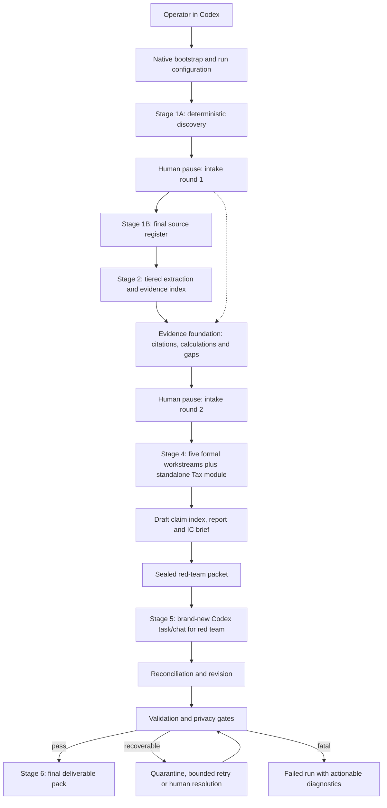

# Due-diligence engine architecture

## Status and scope

This document defines the implementation architecture. Phase 7 implements the deterministic source register, tiered local-first extraction, two-round evidence-grounded intake with real human pauses, and an extraction-dependent evidence/calculation foundation. Phases 8 and 9 implement the sequential analytical workstreams and standalone Tax module. Phase 10 implements structured report assembly, the deterministic two-page IC brief and fail-closed candidate-bundle validation. Phase 11 implements the three-class routing contract, complete local task/research ledgers and one Codex-first, Claude-compatible file-backed runtime flow. Independent red-team execution and final release reconciliation remain later-stage contracts. The primary runtime harness is **Codex**. Deterministic supporting code targets **Python 3.11 or later**. The native path works without Docker; a container may later be offered only as an optional convenience.

The design optimizes for an auditable cold run over an unseen, confidential room. It separates repeatable mechanics from model judgment, makes human pauses resumable, isolates red-team context, and never turns a partial or privacy-unsafe run into an apparent success.

## Assumptions and non-assumptions

Assumptions justified by the brief or current directive:

1. The operator has Git because the evaluation starts from a clone, Codex because it is the selected harness, and Python 3.11+ because it is the selected supporting runtime.
2. Codex is already usable under the operator's subscription. The engine will not ask for a provider API key or make direct model API calls from Python.
3. A run has local read access to one data-room folder and local write access to a separate output folder.
4. The deal lead can edit or supply Markdown/JSON answer files at two explicit pauses.
5. The numbered stages are contract labels implemented as a dependency graph: round one occurs after quick deterministic discovery, and round two occurs after the complete source register and a preliminary full extraction pass.

This design does **not** assume an operating system, Docker, a GPU, Microsoft Office, LibreOffice, Tesseract, a database, cloud storage, a queue, telemetry, third-party logging, direct API credentials, or a particular package manager. Optional detected tools may accelerate work but cannot be on the required path. Whether dependency installation must work without internet access is not stated and remains open.

## Execution planes

| Plane | Responsibility | May reason? | May mutate source room? | Principal artifacts |
|---|---|---:|---:|---|
| Deterministic local processing | Inventory, hashing, safe archive inspection, native extraction, evidence addresses, calculations, ledgers, rendering, validation | No | No | Register, extraction records, evidence index, calculations, manifests |
| Codex reasoning (Claude Code-compatible boundary) | Dynamic questions, classification escalation, workstream analysis, synthesis and drafting | Yes | No | Questions, findings, report draft, task records |
| Human/deal-lead pauses | Answer evidence-driven questions, optionally enable narrowly scoped public research, resolve material ambiguity | Human judgment | No | Answers and signed pause/resume records |
| Independent red-team execution | Refute issues, independently recompute headline numbers, find gaps | Yes, only in a brand-new Codex task/chat | No | Allowlisted sealed-packet manifest, challenge log, recalculations, isolation manifest |
| Validation and failure handling | Enforce stage contracts, citation resolution, privacy, completeness and honest failure states | Deterministic rules plus explicit human review gates | No | Validation report, quarantine ledger, terminal run status |

## System context and flow



Stage 3 comprises both human pauses and their question-generation/resume contracts. Round one follows quick deterministic discovery. Round two follows the complete source register and preliminary full extraction. Stage 4 starts only after round two is answered or the deal lead explicitly records that an answer is unavailable. Stage 6 packages only validated artifacts.

## Repository boundaries

Names below are contracts. Register, extraction, intake, evidence, analysis and
Phase 10 report-bundle and Phase 11 runtime/logging components exist; red-team packaging and final release
reconciliation remain planned.

```text
AGENTS.md                         Codex entry contract and privacy rules
README.md                         clean-clone setup and one-path runbook
pyproject.toml                    Python 3.11+ package and locked tool config
src/dd_engine/
  bootstrap/                     configuration and capability discovery
  inventory/                     file walk, hashes, duplicates, versions, archives
  extraction/                    native parsers, confidence and escalation packets
  evidence/                      typed records, native citations and calculation validation
  reporting/                     Phase 10 synthesis, deterministic PDF and fail-closed checks
  tax/                           standalone structured tax analysis and cross-links
  state/                         resumable run state and stage manifests
  runtime/                       task/research ledgers, route checks and log audit
  validation/                    later independent red-team/release gates
prompts/
  intake/                        evidence-driven round contracts
  workstreams/                   five scoped analyst contracts
  tax/                           standalone tax-analysis contract
  red-team/                      new-task/chat refutation contract and packet allowlist
  runtime/                       end-to-end engine and isolated red-team prompts
config/
  model-routing.yaml             three-class route policy, not provider credentials
  privacy.yml                    deny-by-default egress policy
schemas/                         artifact JSON Schemas
tests/                            unit, fixture, failure and clean-clone tests
synthetic-room/                  exactly 90 visible files; one ZIP contains 10 members
runs/<run-id>/                   local, append-only run artifacts
```

The source room is always read-only. All derived content is written beneath the selected run directory, which must be outside the source room to prevent recursive ingestion.

## Deterministic local processing

### Bootstrap and configuration

The native bootstrap verifies Python `>=3.11`, creates or uses an isolated local environment, validates config, checks that source and output paths are distinct, and reports optional capabilities. It must not require Docker. The setup guide will present one primary path and a timed smoke test rather than a menu of partially supported options.

No exact dependency manager or system utility is mandated at architecture time because the source brief does not provide those environmental guarantees. The implementation must choose and lock Python dependencies that install and smoke-test within the 20-minute clean-clone gate.

### Source register

The registrar walks all files without executing content or macros. Each entry receives a stable `document_id`, relative path, size, media type, SHA-256 hash, container/member path, timestamps where available, parser status, duplicate group, version/supersession candidates, classification, sensitivity flags and error codes. The synthetic-room register must contain exactly 100 logical artifacts: 90 visible files, including one ZIP container, plus exactly 10 registered members inside that ZIP.

Archives are treated as containers. Expansion must reject path traversal and unsafe members, cap nested work deterministically, and record skipped content rather than silently omitting it. Exact size/depth limits require implementation benchmarks and are an open decision.

Byte-identical files are deterministic duplicates. Supersession is a candidate relationship based on filename/version metadata and changed content; it is never silently resolved. The register records both the proposed winner and the evidence for that proposal.

### Tiered extraction

The Phase 5 extraction ladder is cheapest and most deterministic first:

1. Tier 0 locally parses native PDF text, DOCX paragraphs/tables, XLSX cells and structure, true CSV bytes, and image metadata.
2. Tier 1 locally renders only low-text/image-only PDF pages and standalone images that need visual review, extracts embedded PDF/DOCX images, and optionally invokes detected Tesseract OCR.
3. Tier 2 writes a structured pending Codex/Claude vision-review queue. Python makes no model call and every queued result remains null until a later authenticated harness task records actual review.
4. Unreadable or unsupported content receives an explicit terminal reason rather than disappearing.

Every registered source receives one of `successfully_extracted`, `partially_extracted`, `queued_for_vision`, `unsupported` or `failed`. The local layer records raw values, formulas and source-cached values separately, hidden sheet/row/column state, merged and named ranges, number formats, page/sheet coordinates and parse warnings. It never executes workbook macros or recalculates a workbook. Cached formula values are evidence, not proof of recalculation; any later analytical recomputation must be a separate record based on cited inputs.

Source-level cache identity includes the source SHA-256, extractor version and complete extraction configuration/capability fingerprint. The engine verifies current source bytes against the register before cache lookup, retains old configuration namespaces for audit, and never reuses a result across a mismatched source hash.

### Evidence addresses and citations

An immutable evidence record contains:

```text
document_id + content_hash + native_locator + extracted_span_hash + extraction_method
```

Citation locators are locked by format:

- PDF: source ID, source hash and one-based page number.
- Spreadsheet: source ID, source hash, sheet name and cell or cell range.
- DOCX: source ID, source hash and paragraph number or table/row locator; a rendered page may be added only when that page was produced deterministically.
- Image: source ID, source hash, image/page index and rectangular region coordinates in the intrinsic source coordinate space.

Archive members also retain their container/member path, but that path does not replace the required format locator. The citation index stores these fields structurally rather than embedding an unparseable prose reference.

Every material claim receives a stable `claim_id`, at least one resolvable evidence address, evidence strength, confidence, inference/direct-observation label, workstream owner and decision impact. Validators reject dangling addresses and flag unsupported or overconfident claims. Source text is quoted only minimally; the report points back to the source location.

Phase 7 stores six typed run-local JSONL collections: claims, evidence,
calculations, contradictions, gaps and issues. Evidence records retain the exact
extracted value/text, extraction confidence, source/version status and whether
they support or contradict a claim. Potentially superseded citations require an
explicit acknowledgement. Exact duplicates share one independence key derived
from the register duplicate group or checksum and therefore count only once as
corroboration.

The `evidence` command depends on completed registration and extraction but may
run while intake is paused. It carries every available answer verbatim through
answer provenance and represents absent, vague or narrowed replies as gaps. It
does not change stage state, complete intake, start `analyse`, generate workstream
prose or create report artifacts.

### Calculations

Python calculation modules create transparent input tables and formula outputs for EBITDA bridges, customer concentration, debt/net-debt, working capital, payroll/headcount, tax tie-outs and other headline figures. Each result records source cells, formula/version and output hash. Reported and recomputed results remain separate. Period, currency, sign and unit normalization is explicit; missing inputs stay null and block recomputation; rounding and deterministic/model-assisted method are recorded. Codex interprets the result; it does not replace the arithmetic ledger.

## Harness reasoning

Codex is the primary orchestrator and model-access path. Claude Code may instead follow the same checked-in file prompts and CLI contract. The active harness invokes local Python stages, writes structured reasoning artifacts, stops at human gates and records task events. Python does not import a provider SDK, read an API key or initiate a model request. The repository never infers a concrete model name from a logical route.

### Routing policy

Routing uses exactly three logical classes so it remains explicit while tolerating the operator's subscribed model availability:

| Profile | Intended use | Default selection rule | Escalation rule |
|---|---|---|---|
| `local_deterministic` | Inventory, hashing, archive inspection, native extraction, spreadsheet calculations, citation validation and output checks | Python only; zero model calls | A reasoning task is a new logged task, never a relabelled local operation |
| `economical_reasoning` | Classification, mechanical document triage and bulk low-risk structuring | Cheaper suitable model only when the active harness actually exposes one | Use the single visible model or frontier route with an honest fallback record when no cheaper model is available |
| `frontier_judgment` | Financial reasoning, contradiction resolution, contract analysis, intake prioritisation, report drafting and independent red team | Strongest suitable model actually available to the harness | Red team still requires a brand-new isolated context; fail isolation rather than reuse drafting context |

`config/model-routing.yaml` stores the logical policy but leaves concrete model IDs null. At execution, the harness records an actual model only when its exact identifier is visible. Otherwise the ledger stores null plus a reason. Merely documenting an economical route does not establish that a cheaper model exists or was called, and an economical task may honestly fall back to the only visible model.

### Workstream contracts

The five formal workstreams are:

1. Financial
2. Commercial
3. Legal/contractual, explicitly scoped to Irish jurisdiction
4. Operational/management
5. IT

Each consumes the shared evidence index and relevant deal-lead answers, but writes separate claim, gap, question and priority records. Cross-workstream claims are linked, not copied. Each section must state findings, evidence, contradictions, calculations, limitations, management questions and go/no-go or price/structure implications.

The implemented analysis command is deliberately sequential. `analyse --phase 8`
requires completed two-round intake and creates Financial and Commercial outputs
plus calculation and evidence-backed customer-grouping schedules. It leaves the
analysis stage running. `analyse --phase 9` requires current passing Phase 8
validation, creates Legal/contractual, Operational/management and IT outputs plus
the standalone Tax output, runs citation/version/tax/privacy/missing-evidence
checks, and completes analysis. Both phases write into typed shared JSONL stores,
are fingerprinted for safe reuse, and do not draft `report.md`.

### Tax handling

Tax is a **mandatory standalone analytical module**, not a sixth formal workstream and not owned by Financial. It consumes the shared evidence index and deal-lead answers, writes structured `tax/tax-findings.json` plus narrative `tax/tax-analysis.md`, and supplies its own top-level Tax section in `report.md`. VAT, PAYE, CT, amended returns, tax clearance, tax computations, invoice samples and tax-response versions receive explicit coverage and tie-outs.

Each tax finding has its own ID, evidence links, calculation links, confidence, impact and follow-up. Where relevant, the module creates bidirectional finding links into Financial, Legal/contractual, Operational/management and IT; absence of a relevant cross-link is a validation error. The five formally named workstreams remain unchanged.

Irish legal and tax outputs are explicitly commercial diligence, not formal legal
or tax opinions. Effective clauses and revised tax responses are selected through
registered version evidence. Any public research is supplemental, excludes
confidential document text, and is recorded locally with query, timestamp,
purpose, URL and conclusion; the current default records `not_performed`.

### Intake questions and human pauses

Round one uses the register plus an early-evidence slice of extraction: failures, unreadable or vision-dependent material, explicit contradictions, unsupported material figures and broken document references. Questions without a source are permitted only for essential transaction context (perimeter, price/structure, thesis and scope/materiality). Round two requires the complete source register, full extraction and explicit round-one answer ingestion; it targets unresolved contradictions, unsupported figures, missing references, customer groups, contract versions/consents, debt/HP, tax and workforce discrepancies.

Every question records its ID/round, priority, exact wording, decision relevance, evidence source IDs or structured gap, expected answer type, blocking status and the stages affected by changed evidence. Duplicate candidates are suppressed, round limits are enforced and every excluded candidate keeps a reason. At each pause the engine writes JSON and Markdown packets and the run state becomes `awaiting_input`.

Resumption requires an explicit JSON answer file. The engine hashes it, records who/when if supplied, retains each answer verbatim and creates only conservative normalisation. `N/A`, `None`, silence, cross-references, partial and vague replies remain open or narrowed rather than being silently completed. Round one resumes to round-two generation; round two resumes to intake completion. If an already-ingested answer changes, only the declared affected round/stages and their dependants are invalidated.

### Report drafting

Phase 10 drafts from the validated structured claims, evidence, calculations,
contradictions, gaps and verbatim intake artifacts, never directly from an
unbounded room dump or prior conversational reasoning. `report` requires current
passing Phase 8/9 output and writes `outputs/due_diligence_report.md`,
`outputs/ic_brief.md`, `outputs/ic_brief.pdf`,
`outputs/outstanding_information.md` and
`outputs/report_validation.json`. The report uses the prescribed eleven-section
order and renders every material finding through a fixed adviser-quality schema.
It is decision-focused but gives no independent valuation opinion.

Human-readable citations are formatted only from locators that pass the native
citation engine. Material findings without valid support, dangling displayed
citations, untraceable calculations, missing sections and placeholder text fail
closed. The input and output fingerprints make identical runs reusable while
detecting upstream or bundle tampering.

The IC brief is authored as Markdown and rendered in-process by deterministic
pure-Python code to exactly two ISO A4 pages. Fixed built-in fonts, fixed margins,
an explicit page boundary and a minimum font-size floor prevent silent reflow.
The renderer raises before frame overflow; a pure-Python PDF parser validates the
media boxes, page count, text anchors, extractable citations and font operators.
No Office, LibreOffice, Docker, browser or external renderer is permitted on this
generation path. Page images may be produced locally after generation solely for
the required human visual inspection.

`validate` re-runs the complete candidate-bundle checks and records success or a
resumable failed state. Its passing status means the Phase 10 bundle passed its
defined gates; it does not claim independent red-team completion or final trial
release readiness. Those facts are explicit in the validation artifact.

## Independent red-team execution

The red-team packet is deny-by-default and contains only files enumerated in a sealed allowlist: the final candidate report, claim index, source register, specifically selected evidence records/source files, calculation inputs/results, outstanding-gap list and red-team instructions. Its manifest records each permitted path and hash. It excludes drafting conversation, workstream scratch notes, prompt transcripts, rejected drafts, prior agent messages, private reasoning and planted-issue ground truth.

Execution occurs in a brand-new Codex task/chat with a new task/chat ID and no inherited messages or context. An ordinary subagent is not independent unless the harness exposes verifiable non-inheritance and the isolation manifest records that proof; otherwise it is rejected. If launch cannot be automated, the run pauses and instructs the operator to open a brand-new Codex task/chat and attach only the allowlisted sealed packet. The original drafting context may never perform or simulate the independent pass.

For every material issue, red team records `upheld`, `modified`, `rejected` or `insufficient evidence`; it recomputes headline numbers from cited source inputs and adds newly found gaps. Drafting reconciles each challenge, but cannot delete the original challenge record. The standalone log and report appendix must reconcile by ID.

## Validation and failure handling

### Stage contracts

Each stage writes a versioned manifest containing inputs, outputs, hashes, configuration, start/end times, status and validation results. A stage is idempotent for identical input/config hashes. Resumption starts from the last valid manifest rather than reusing unverified partial files.

### Recoverable failures

Unreadable, encrypted, corrupt, unsupported or oversized individual files are registered and quarantined with a reason. Bounded retries may use a different local parser or approved model tier. The rest of the room continues, and every affected conclusion carries a gap/limitation. A missing deal-lead answer is represented explicitly and may lower confidence.

### Fatal failures

The run stops with actionable diagnostics for an invalid source/output path relationship, corrupted run state, privacy-policy breach, missing required stage manifest, red-team isolation failure, unresolvable material citations, incomplete five-workstream coverage, missing standalone Tax output/cross-links, invalid A4 brief geometry/page count, or missing final deliverables. Fatal status never emits a `SUCCESS` marker, although diagnostic and partial artifacts remain local for repair.

### Final gates

A successful package requires:

- all six stage contracts complete;
- two intake pause records;
- five formal workstream outputs plus standalone structured Tax output, report section and required cross-links;
- every material claim citation resolvable;
- model, token and cost-status records complete;
- public research either logged or explicitly `not_performed`;
- privacy and egress checks passed;
- a brand-new red-team task/chat, allowlisted sealed packet, isolation proof and challenge reconciliation passed;
- an A4 `ic-brief.pdf` generated and checked in-process by pure-Python code with exactly two pages; and
- all five handover deliverables present and tied to one run ID.

## Privacy and public research

All room and derived artifacts remain local except the minimum content deliberately supplied through Codex to its model provider. Telemetry and third-party log sinks are disabled; logs are append-only local files. Secrets, provider keys and raw room content are never written to config. The source room is never uploaded wholesale by supporting Python code.

Public research is optional and disabled by default. When explicitly enabled, only the confirmed public target name and market may be sent via Codex's research capability. Queries must not include room text, personal data, confidential figures or document-derived allegations. Every attempted, rejected and completed research action is logged with query, purpose, timestamp, disposition, URL when applicable, retrieved-page hash, public facts used and downstream claim IDs. If research remains disabled, the ledger records `not_performed`.

## Run logging, token usage and cost

`logs/run-log.jsonl` is an append-only local task ledger and
`logs/run-log.md` is its regenerated human summary. The documented CLI logs each
real deterministic stage invocation. Codex or Claude Code appends each reasoning
task through `log-task`. Every record includes run/stage/task identity, purpose,
harness, visible actual model or a null reason, route, timestamps and duration,
source IDs supplied, input/output tokens and their basis, API-equivalent cost and
basis, billing mode, retry/fallback/error status and hashes of run-local output
artifacts. `audit-logs` rejects duplicate task IDs, raw-sensitive-content flags
and completed manifest stages without a successful task record.

Usage and cost are never fabricated. Token basis is `actual`, `estimated` or
`unavailable`; unavailable values are null with a reason. API-equivalent cost is
populated only from reliable tokens and a versioned rate-card reference. Billing
mode separately records subscription, direct API, local zero-model, other or
unknown. Thus subscription billing does not become a fictional per-task charge.

`logs/public-research-log.jsonl` separately records each attempted, rejected,
completed or not-performed action with query, timestamp, purpose, URL, source
type, use decision, supported claims/citations, retrieved-page hash when retained
and a false confidential-content flag. It never stores raw page content merely
to prove research occurred. `logs/run-log-validation.json` records the local
ledger audit result.

## Clean-clone and keyless operation

The target operator journey is defined completely in `docs/runtime-flow.md` and
`prompts/runtime/run_engine.md`:

1. Clone the repository.
2. Open it in an already authenticated Codex environment (or Claude Code using the same local file contract).
3. Follow one native Python 3.11+ bootstrap path from README.
4. Point the run configuration at a local room and separate local output folder.
5. Start the runtime prompt, answer the two generated question packets at the two enforced pauses, and resume each time with an explicit JSON answer file.
6. Complete the candidate report, request red team in a brand-new context, reconcile verified challenges and receive a validated local deliverable directory.

No `OPENAI_API_KEY`, Anthropic key or provider SDK is requested because the authenticated harness supplies any model access. Python performs local deterministic work only. Docker cannot be part of this acceptance path. Harness-specific abilities such as exact model visibility, token counters, task creation or selectable model tiers are checked at runtime and recorded as available or unavailable rather than assumed. A fresh-clone test records wall-clock time and fails if the engine is not running within 20 minutes.

## Run artifact contract

```text
runs/<run-id>/
  manifest.json
  checkpoints/                  versioned stage-state records
  logs/                         local run, route, cost and research ledgers
  source_register/              source register CSV/JSON and inventory metadata
  extracts/                     manifest, JSONL units, failures, vision queue, renders and cache
  intake/                       both question, answer and resume records
  evidence/                     six record stores, citation validation and coverage ledger
  workstreams/                  five workstreams, Tax module and calculations
  red_team/                     sealed packet, isolation proof and challenge log
  outputs/                      report, IC brief and final validation artifacts
```

Every generated run artifact records the immutable run ID. Later analytical
artifacts retain the names and validation contracts described elsewhere in this
document, nested under the owning directory above.

## Architecture risks

1. Codex subscription surfaces may not expose exact token counts, monetary cost or programmable model selection; the ledger can be honest yet still miss the evaluator's preferred precision.
2. Automating creation of a brand-new Codex task/chat may vary by harness surface. The mandatory manual new-task/chat fallback preserves isolation but adds operator friction; an unverifiable ordinary subagent is never accepted.
3. The locked format-specific citation resolver and pure-Python A4 paginator are correctness-sensitive; tests must cover DOCX structure drift, image coordinates, A4 media boxes and boundary pagination.
4. Spreadsheet cached values can be stale, while full formula recalculation without an office engine is not guaranteed. Explicit Python recomputation covers headline figures but not arbitrary workbook logic.
5. Optional public research can leak confidential context if the allowlist/filter fails. Default-off configuration, restricted target/market fields and complete action logging are mandatory mitigations.
6. Fitting every specified family and quirk into exactly 90 visible files plus 10 ZIP members requires a deliberate composition manifest and may reduce redundancy relative to the real room.
7. Model context limits make dumping the whole room unsafe and unreliable. Structured retrieval and claim-level evidence reduce, but do not eliminate, omission risk.
8. Irish legal and tax conclusions require disciplined scope and citations; model reasoning is not a substitute for specialist advice.
9. The 20-minute gate depends on evaluator machine and dependency availability not specified in the brief. The implementation must benchmark and minimize the native path.
